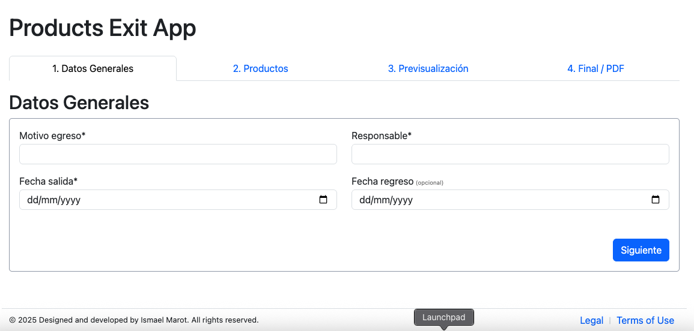
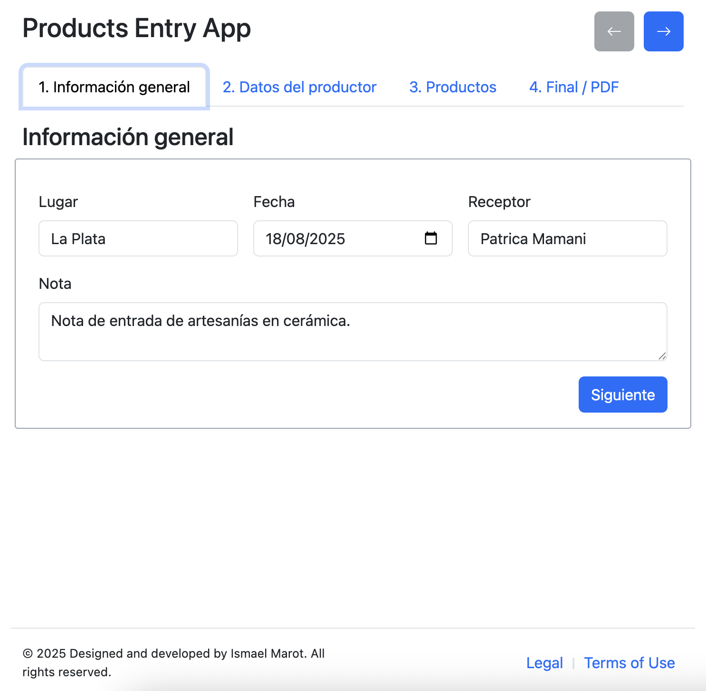
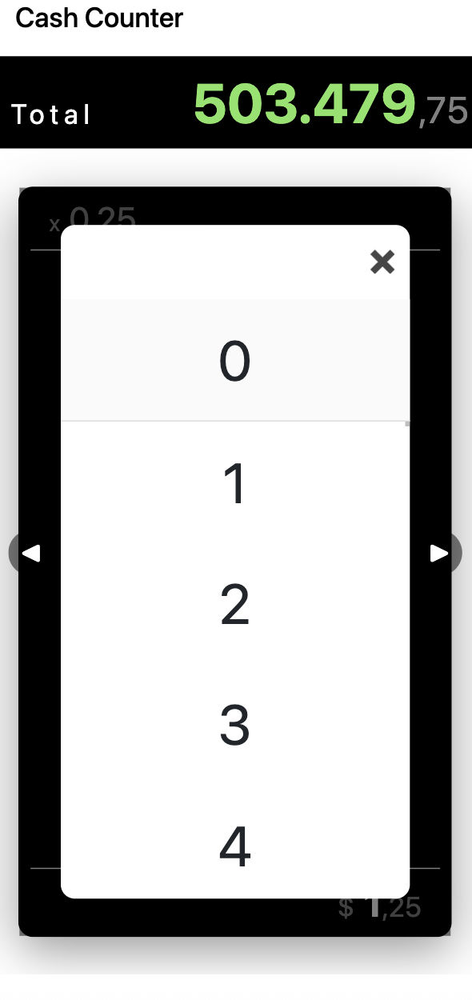

<table>
  <tr>
    <td style="padding:10px; border:1px solid #ccc; vertical-align: top;">
      

        
        
      

    </td>
    <td style="padding:10px; border:1px solid #ccc; vertical-align: top;">
      

        
        
      

    </td>
    <td style="padding:10px; border:1px solid #ccc; vertical-align: top;">
      

        
        
      

    </td>
  </tr>
</table>
